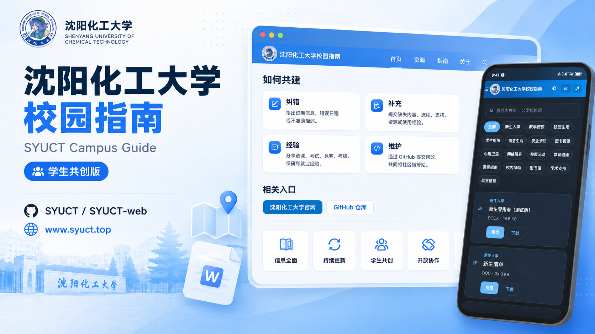

<table>
  <tr>
    <td width="70%" valign="top">
      <h1>👋 各位开源友友们好，我是 hancc</h1>
      
本科毕业于<strong>沈阳化工大学计算机科学与技术专业</strong>。

      
目前正在开发维护：

      <ul>
        <li>🌐 <strong>SYUCT-web</strong> —— 指南网页端</li>
        <li>📱 <strong>SYUCT-mini</strong> —— 微信小程序端</li>
      </ul>
      
兼职创作 <strong>AI 小说</strong>。

    </td>
    <td width="30%" align="center" valign="top">
      
      <h3><a href="https://github.com/SYUCT">SYUCT</a></h3>
      
沈阳化工大学校园指南 学生共创组织

      
<a href="https://github.com/SYUCT"><strong>访问 SYUCT 组织主页</strong></a>

    </td>
  </tr>
</table>

## 我参与的项目

### SYUCT

沈阳化工大学校园资料与信息服务项目。

- [SYUCT-web](https://github.com/SYUCT/SYUCT-web)
- [SYUCT-mini](https://github.com/SYUCT/SYUCT-mini)

